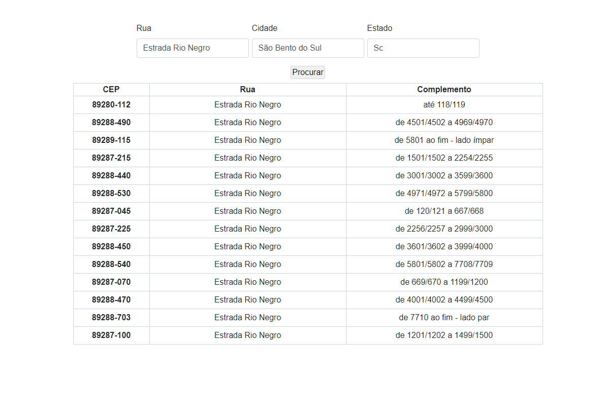

# Consumo da API Via Cep

# O que é?

Um simples projeto para estudos de consumo de API, utilizando Fetch, para obter dados da Via Cep API
O usuário preenche os campos do seu endereço, fazendo uma requisição ao clicar no botão e gerando uma tabela dinâmica
com todos os CEP's de acordo com os dados informados.

